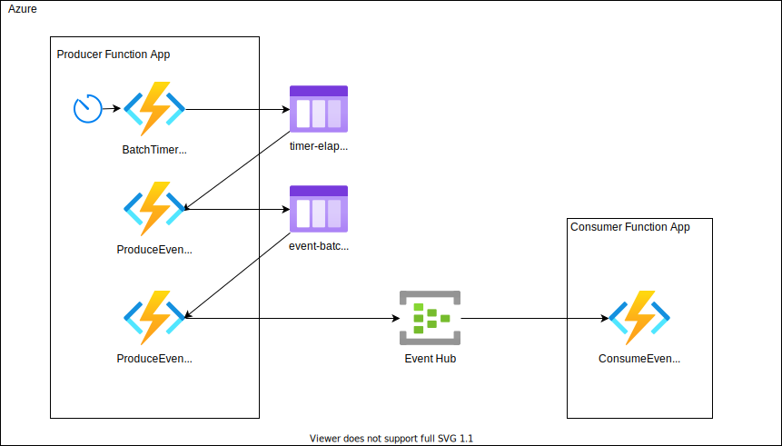

# Java Functions Event Hub Throughput

This is an example of a high-throughput event processing scenario with Java Functions and an Azure Event Hub.

## Solution Overview

High throughput event processing pipelines are prime candidates for Azure Functions and Event Hubs. In these scenarios, event produces can stream events into an Event Hub and Azure Functions can retrieve batches of those events and process them.

In our scenario, Azure Functions are being used to simulate the event producer as well as processing the events from the Event Hub.

To achieve high throughput in the production of events, two Functions are used in the Producer Function App.

The first, is a timer trigger that generates a number of batch messages and puts them in an Azure Storage Queue. Timer triggers will not execute on schedule, even if the timer has elapsed, when a previous execution of the timer-tiggered Function is still running. Also, timer triggers only fire once per Function App regardless of the number of instances of the Function App running the the hosting plan. To get around these issues if we want to generate a high volume of events, we create batch messages.

The second Function is triggered off of unprocessed Azure Storage Queue messages. When invoked, it generates the event batch and then send the batch to the Event Hub. Due to the configuration of the underlying Event Hub SDK, events are batched to a single partition in the Event Hub per Function execution when using an output binding. Therefore, a high number of batch jobs are needed to saturate all Event Hub partitions.

The consumer Function App is triggered by unprocessed (non-checkpointed) events in an Event Hub partition. The consumer Function App can scale out to the number of partitions in the Event Hub to maximize processing throughput since one instance can lock 1 to many partitions for processing.

## Settings

Each Function App requires a number of App Settings to work properly.

1. Producer
    * EventHubConnection - Connection string for the event hub with Send claims
    * QueueStorage - Connection string for the Storage Account to create the message queue in
    * MessageQueueName - The message queue name. If it does not exist, it will be created
    * EventHubName - The name of the Event Hub (not the namespace)
    * MinBatchesPerTimer - Minimum number of batches per timer execution (recommended to be the number of Event Hub partitions)
    * MaxBatchesPerTimer - Maximum number of batches per timer execution
    * MinEventsPerBatch - Minimum number of events per batch (recommended to be close to the batch size for the processor Function)
    * MaxEventsPerBatch - Maximum number of events per batch
    * MinValueForEvent - Minimum value to send for each event (this is how many prime numbers to calculate for this event)
    * MaxValueForEvent": Maximum value to send for each event
    * TimerSchedule - The timer schedule ( recommended to be every second "* * * * * *")
